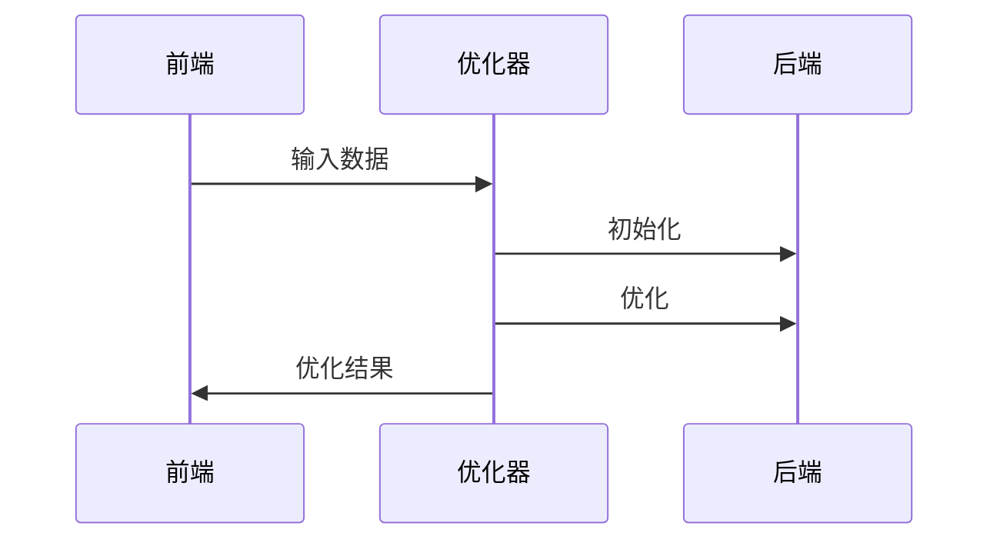

# Develop
{: .no_toc }

1. TOC
{:toc}
---

## body model

这部分定义了所使用的多种人体参数化模型，规定了函数的输入输出，每个参数化模型的输入是一组参数，输出是

- [ ] Skeleton
- [x] Basic LBS model for: SMPL, SMPL+H, SMPL-X, MANO, FLAME
- [ ] SMPL+H
- [ ] SMPL-X
- [x] SMPL + Vposer
- [ ] STaR
- [ ] 如何叠加多种不同的模型

对于一个任意的LBS模型，需要包含的内容有：
|key|shape|description|
|----|----|----|
|`f`|(NUM_FACES, 3)|三角面片|
|`J_regressor`|(NUM_JOINTS, NUM_VERTICES)|关节点回归器|
|`v_template`| (NUM_VERTICES, 3) | 标准姿态下的模板坐标|
|`J`|(NUM_JOINTS, 3)|标准姿态下的关键点|
|`weights`| (NUM_VERTICES, NUM_JOINTS) | 蒙皮权重 |
|`kintree_table`|(NUM_LIMBS, 2)|关节的连接顺序|

对于一个有姿态的模型，要将其转换到canonical的姿态，需要的参数有：

- v_posed: 当前的顶点位置
- J_canonical: canonical下的关节位置，即(poses=0, shapes,Rh=0,Th=0)计算得到的位置
- params：模型的poses, shapes, Rh, Th参数

交互式模型可视化：
```bash
python3 apps/vis3d/vis_smpl.py --cfg config/model/smpl.yml
```
TODO:
- [ ] 增加参数的导入、导出
- [ ] 交互式的通过改变骨架来修改SMPL参数
- [ ] 增加mesh的纹理贴图可视化

## dataset

这部分代码定义了基础的数据集，复杂类型的数据集需要从基础类型继承而来。

输出：

在代码运行的时候的输出，只允许实现渲染模型到图像上的，不要叠加任何附加功能。
任何其他的附加功能都使用脚本实现，避免代码功能冗余。

渲染到图像上的直接调用`plot_meshes`函数，画2D骨架到图像上直接调用`plot_keypoints`函数。

## 多视角重建

这部分使用了多视角进行重建，用于针对视角相对密集的场景，可以使用多视角的先验预先筛除离群点。

## Loss

- [ ] 重投影误差使用相机平面的：相比于图像平面，可以避免图像分辨率的影响；相比于反投影射线，可以利用远近的影响
- [ ] 增加mesh的碰撞检测的loss
- [ ] 增加两个手的碰撞检测

关键点loss设计：
|重投影|射线|相机平面|
|----|----|----|
|受尺度、图像分辨率影响|无法优化相机外参，无法考虑到相机远近的影响||
|数值有真实意义|相对更加线性，梯度好写一点||

## 优化框架更新
- [x] 支持相机参数与其他模型无关参数的优化
- [x] 支持设置batch_sizes
- [x] 支持初始化部分进行优化
- [x] 支持初始化提供多个初值
- [x] 支持对多个初值的最终选择
- [ ] 支持多人同时优化
- [x] 支持同样的loss函数，不同阶段的不同权重
- [x] 支持不同优化步骤使用不同的优化器

所有与优化无关的部分都不应该放到优化里面，例如：
- 单人的问题中人体关键点的跟踪
- 多人问题中多人关键点的跟踪
- 多视角里多人的匹配
- 镜子里内外的选择
- 镜子+多人里人的匹配、镜子内外的确定
这些步骤应该在预处理过程或标注过程解决

## Pipeline

- [ ] SMPLify-X for SMPL
- [ ] SMPLify-X for SMPL+H
- [ ] SMPLify-X for SMPL+X
- [ ] MV1P
- [ ] MV1P for SMPL+H
- [ ] MV1P for SMPL+X
- [ ] MV1P for MANO
- [ ] MV1P for two hands
- [ ] MV1P for FLAME

## 静止重建pipeline

相机标定：
{: .note }
使用colmap进行相机标定

人体重建: 重建身体+手

```bash
python3 apps/fit/triangulate1p.py --cfg_data config/data/mv1p.yml --opt_data args.path ${data} args.out ${data}/output-keypoints3d --cfg_exp config/recon/mv1p-total.yml
cp -r ${data}/output-keypoints3d/keypoints3d ${data}
```




test youtube


test table

|              Stage | Direct Products | ATP Yields |
| -----------------: | --------------: | ---------: |
|         Glycolysis |          2 ATP              ||
| ^^                 |          2 NADH |   3--5 ATP |
| Pyruvaye oxidation |          2 NADH |      5 ATP |
|  Citric acid cycle |          2 ATP              ||
| ^^                 |          6 NADH |     15 ATP |
| ^^                 |          2 FADH |      3 ATP |
|                               30--32 ATP        |||