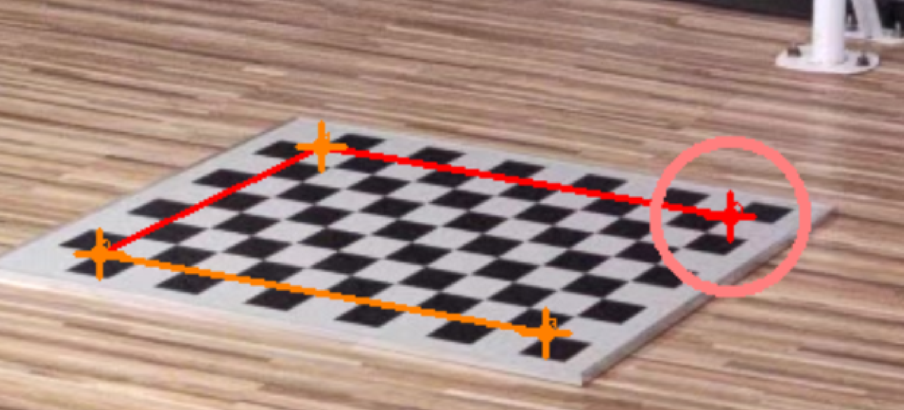

# 标注工具
{: .no_toc }

这部分包含了多种数据标注的工具，基于OpenCV实现。

如果只使用标注部分，安装比较简单，主要依赖于OpenCV库，可以直接在现有的环境上安装
```bash
python3 setup.py develop
```

打开方式：
1. Linux下，使用`ssh -X`登录到服务器，在服务器运行代码。即可使用X server可视化
2. Linux下，使用`sshfs`将远程目录挂载到本地，在本地运行代码，速度会比1更快
3. Windows下使用VNC，在服务器开启虚拟桌面，在本地连接服务器的虚拟桌面，会比较卡

1. TOC
{:toc}
---

## 总体需求

- [ ] 实现一个bbox，然后进行放大的需求


## 棋盘格角点标注

这个用于户外的数据，自动检测棋盘格的结果非常不可靠，不如直接手动标注棋盘格的四个角点。

首先要创建角点，参数为棋盘格的边长x格子数，实验室的标定板是`0.8 0.5`，公司的标定板是`0.6 0.42`

```bash
python3 apps/calibration/create_marker.py ${root}/ground1f --grid 0.8 0.5 --corner
python3 apps/calibration/create_marker.py ${root}/ground1f --grid 0.6 0.42 --corner
```

其次要标注角点

```bash
python3 apps/annotation/annot_calib.py ${root}/ground1f --annot chessboard --mode chessboard --pattern 2,2
```

<div align="center">
    
    <br>
    <sup>棋盘格不是中心对称的，标注的时候与示例对应，第一个点需要在角落为黑色的一侧。依次为右上角，左上角，左下角，右下角</sup>
</div>

标注过程：

1. 鼠标中键进行放大缩小，可以放大到像素级
2. 鼠标左键点击角点，如果点错了可多次点
3. 空格键确认当前点，标注下一个点
4. 标注完所有点之后，`q`退出当前视角，在终端输入`y`保存。切换到下一个视角
5. 不一定所有视角都要标

## 关键点标注

```bash
python3 apps/annotation/annot_keypoints.py ${data}
```

|name|value||
|----|----|----|
|ext|.jpg/.png|图像后缀|
||||

## Mask标注

标注单人的mask 
```bash
python3 apps/annotation/annot_mask.py ${data} --mask mask_cihp
```

标注多人的mask：TODO

## 物体标注

```bash
python3 apps/annotation/annot_track.py ${data} --annot basketball --max_person 1 --step 5
```

使用方式：
- 使用鼠标标注一个物体的框，按`n`键新建。
- 按`g`键自动跟踪，跟踪过程中如果发现错误的框，按`q`停止自动跟踪。

{: .note }
目前还不支持多个物体的标注

{: .note }
需要支持物体类别的标注

重建三维轨迹：
{: .note }
实现多个同类型的物体一起重建的代码；是否可以考虑多个物体与多人一起重建，怎么鲁棒的完成这件事情； 如何把物体的关键点结合进来；

{: .note }
是否可以实现一个通用的多人、多手、多脸、多物体的重建方案。这个方案不用管输入是什么类型的。


## 标注背景的mask


## 多视角匹配点标注

需求：
- [x] 不同视角之间切换
- [x] 增删一个匹配点
- [x] 可视化匹配的点
- [ ] 按下功能键标一个点就BA一下

1. 新增匹配点序列

在不指定的情况下，5个点为一组
```
python3 apps/calibration/create_marker.py ${data} --N 100
```

2. 进行标注


## 多视角同步

### 打开同步窗口

```bash
python3 apps/annotation/annot_mv_sync.py ${data} --scale 0.5
```

流程：

1、开始阶段，找到大部分视角都处于打板结束的位置，然后具体调整不同步的视角。
2、按r，记录当前所有视角的帧数
3、不断向后移动，找到结束时打板结束的位置，微调其他视角
4、按r，记录当前所有视角的帧数
5、按q退出，并在命令行输入y，保存记录的帧数

### 键盘操作

| key | |
| ---- | ------------------------- |
| w    | 向前10帧                  |
| a    | 向前1帧                   |
| s    | 向后10帧                  |
| d    | 向后1帧                   |
| f    | 向前100帧                 |
| g    | 向后100帧                 |
| r    | 记录当前所有视角的帧数    |
| q    | 退出，输入y保存记录的帧数 |
| x    | 取消选中的视角窗口        |

在选中具体视角窗口时，移动操作仅对当前视角有效。退出选中具体窗口，移动操作对所有视角有效。

### 拷贝

```bash
python3 apps/annotation/copy_mv_sync.py ${data} --out ${data}/../actor2-sync
```

去掉一些不同步的视角: 在上述命令中加上可选参数 --sub_ignore sub0 sub1

### 选择数据clip

在完成`copy_mv_sync.py`之后，数据会被拷贝到不同的同步片段里面，对于每一个片段，需要选择要用的数据进行截取。多视角的数据只需要标注一个视角就可以了。

截取片段：

截取动作开始到结尾的部分

```
python3 apps/annotation/annot_clip.py ${data} --mv
```

标注完成之后复制图片，数据会根据起始帧用结束帧拷贝到不同目录

```
python3 apps/annotation/annot_clip.py ${data} --mv --copy
```

### 键盘操作

| w    | 向前10帧                 |
| ---- | ------------------------ |
| a    | 向前1帧                  |
| s    | 向后10帧                 |
| d    | 向后1帧                  |
| f    | 向后100帧                |
| g    | 向前100帧                |
| j    | 选择当前帧作为一段的起点 |
| k    | 选择当前帧作为一段的终点 |
| l    | 确认选中的这一段         |
| q    | 退出                     |

在确定好起点和终点后需要按l来固定这一段，固定后可以用j和k来确定下一段

注意事项：

录标定版的时候也要打板

## 多视角匹配点同时标注

需求：
- [x] 同时可视化所有视角
- [x] 增加多个匹配点
- [ ] 删除当前的匹配点
- [ ] 可视化第i个匹配点
- [ ] 实时重建相机

## 多视角标注

需求：
- 多个窗口一起移动
- 选中某个视角里的某个人
