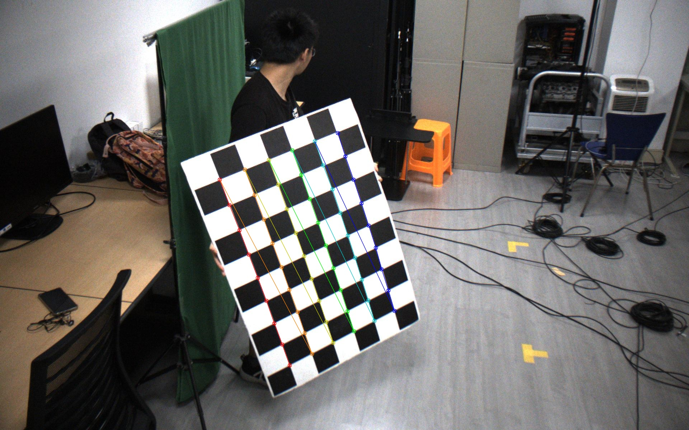
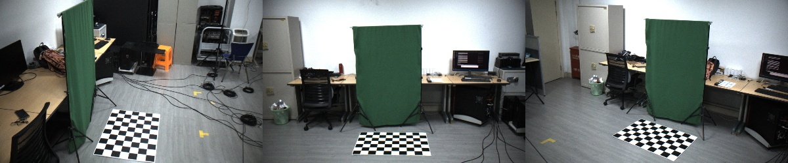
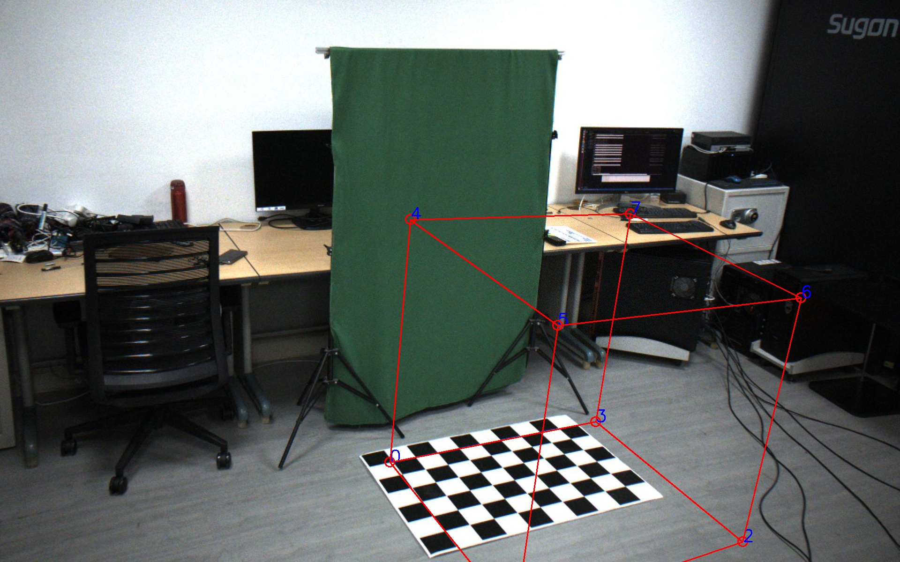

# Camera Calibration

{: .no_toc }

这部分文档包含相机标定的内容，以及多个场景下的相机标定。

1. TOC
{:toc}
---

Before reading this document, you should read the OpenCV-Python Tutorials of [Camera Calibration](https://docs.opencv.org/master/dc/dbb/tutorial_py_calibration.html) carefully.

## Some Tips
1. Use a chessboard as big as possible.
2. Use a chessboard as rigid as possible.
3. You must keep the same resolution during all the steps.

## 0. Prepare your chessboard

下载OpenCV官网上的棋盘格，或自己生成一个，去附近的文印店，告诉老板需要打到一个大的KT板上。并告诉老板需要一格有多长。

## 1. 相机内参标定

### 1.1 获取图像

文件目录组织保持树状结构，所有的图片都保存在`images`目录下

```bash
<seq>
└── images
    ├── 1
    │   ├── 000000.jpg
    │   ├── 000001.jpg
    │   ├── 000002.jpg
    │   └── ...
    ├── 2
    │   ├── 000000.jpg
    │   ├── 000001.jpg
    │   ├── 000002.jpg
    │   └── ...
    ├── ...
    ├── ...
    ├── 8
    │   ├── 000000.jpg
    │   ├── 000001.jpg
    │   ├── 000002.jpg
    │   └── ...
    └── 9
        ├── 000000.jpg
        ├── 000001.jpg
        ├── 000002.jpg
        └── ...
```

### 1.2 检测棋盘格

首先需要检测棋盘格，对于一个`(9, 6)`的棋盘格，每一个格子的长度为`0.1m`，使用以下命令创建与检测棋盘格：

```bash
# detect chessboard
python3 apps/calibration/detect_chessboard.py ${data} --out ${data}/output/calibration --pattern 9,6 --grid 0.1 --seq
```

|参数名称|可选值|含义|
|----|----|----|
|pattern|9,6|棋盘格的角点数|
|grid|0.1|棋盘格的每格的长度|
|seq|bool, 默认False|如果拍的是一段视频，那么使用这个选项可以加速棋盘格的检测，会通过二分法去查找棋盘格|

> 注意：棋盘格并不是一个中心对称图形，其中的(9, 6)指的是角点的数目，而不是格子的数目。

> 注意：对于一张有棋盘格的图像，检测会比较快，如果图像中没有棋盘格，那么检测会很慢，所以需要尽量保证需要检测的图像中包含棋盘格

检测结果会以`json`格式存在`${data}/chessboard`中，可视化的结果会存在`${data}/output/calibration`中。

<div align="center">
    
    <br>
    <sup>棋盘格检测结果</sup>
</div>

### 1.3 内参标定

棋盘格提取之后，计算相机内参。
<!-- After extracting chessboard, it is available to calibrate the intrinsic parameter. -->

```bash
python3 apps/calibration/calib_intri.py ${data} --num 200 --share_intri
```

|参数名称|可选值|含义|
|----|----|----|
|ext|.jpg, .png| 图像后缀
|num|>0|使用的图像数量|
|share_intri|bool, 默认False|是否共享所有相机的内参|

运行完成后，程序会输出`intri.yml`到`${data}/output`目录。
<!-- After the script finishes, you'll get `intri.yml` under `${data}/output`. -->
<!-- > This step may take a long time, so please be patient. :-) -->

> 这一步如果使用200张图需要花费大概2小时

## 2. 相机外参标定

相机外参标定步骤用于确定各个相机的在世界坐标中的位置。通常会使用一些标志点来确定世界坐标。最简单的方式是使用棋盘格，对于大场景无法使用棋盘格的，可以使用场景中的标志点，并测量其实际物理坐标。

### 2.1 使用棋盘格

对于多个相机可以拍到地面的情况，首先将棋盘格放置到地面，确保每一个相机都能看到。接着抓取一帧图片，如图所示。

<div align="center">
    
    <br>
    <sup>将棋盘格放置在地面</sup>
</div>

检测棋盘格：

```bash
python3 apps/calibration/detect_chessboard.py ${data} --out ${data}/output/calibration --pattern 9,6 --grid 0.1 --debug
```

使用标注工具检查检测的棋盘格是否有问题：

```bash
python3 apps/annotation/annot_calib.py ${data} --annot chessboard --mode chessboard
```

|按键|功能|
|----|----|----|
|q|退出标注|
|` `|切换到下一个点|
|`b`|切换到上一个点|
|`e`|对于选定的矩形框，进行检测|

标定外参，注意在这里需要指定之前标定的相机内参的路径：

```bash
python3 apps/calibration/calib_extri.py ${data} --intri <path/to/intri>/intri.yml
```

相机外参将会输出到`${data}`目录下。

#### LightStage

对于LightStage数据，需要使用2048分辨率下的图片
```bash
python3 apps/calibration/calib_extri.py ${data} --intri data/camera/intri_lightstage_2048.yml
# 对输出的相机参数缩小一半，得到1024分辨率下的相机参数
python3 apps/calibration/transform_camera.py ${data} ${data}/1024 --scale 0.5
```
此时的`${data}/1024`目录下即为所需的输出。

#### Hikvision


### 2.2 使用标志点


### 2.3 使用人体关键点

TODO

### 2.4 BA优化

在多相机的情况下，可以利用多视角的一致性信息。

<div align="center">
    
    <br>
    <sup>棋盘格在多个相机内可见</sup>
</div>


```bash
data=/path/to/img
# 以下三种情况选择其中一个
# 1. 只优化相机的RT
python3 apps/calibration/calib_ba.py ${data} --init ${data}/../ground --ground ${data}/../ground --out ${data}/output-ba
# 1. 优化相机的RT，同时优化K
python3 apps/calibration/calib_ba.py ${data} --init ${data}/../ground --ground ${data}/../ground --out ${data}/output-ba-optK --optK
# 1. 优化相机的RT，同时优化K, D
python3 apps/calibration/calib_ba.py ${data} --init ${data}/../ground --ground ${data}/../ground --out ${data}/output-ba-optKD --optK --optD
```

|参数名称|可选值|含义|
|----|----|----|
|init|<path>| 初始化的相机内参与外参的路径 |
|ground|<path>|拍摄的棋盘格放在地面的文件路径|
|out|<path>|标定结果输出路径|
|optK|bool|是否优化相机的焦距、光心，默认False|
|optD|bool|是否优化相机的畸变参数，默认False|


### 单目情况

对于单目的情况，无法使用多视角标定，可直接创建空白的相机，这个相机的焦距会根据输入的图像形状指定，光心在图像中心，旋转为单位阵，位置为0。注意，这样指定的相机无法用于多视角重建的代码，只能用于单视角重建。

```bash
python3 apps/calibration/create_blank_camera.py ${data} --shape 2160 3840
```

## 3. 检查

### 可视化检查

```bash
out=/path/to/output
python3 apps/calibration/check_calib.py ${data} --out ${out} --mode grid --show
```

<div align="center">
    
    <br>
    <sup>可视化虚拟的立方体</sup>
</div>

立方体的顶点0坐标为`(0, 0, 0)`，顶点1坐标为`(1, 0, 0)`，顶点3坐标为`(0, 1, 0)`，顶点4坐标为`(0, 0, 1)`。

### 定量结果
如果使用了BA来进行标定，可以通过这一步定量计算所有帧的平均标定误差。

```bash
out=/path/to/output
python3 apps/calibration/check_calib.py ${data} --out ${out} --mode match --show
```

<!-- ## 1. Record videos
Usually, we need to record two sets of images, one for intrinsic parameters and one for extrinsic parameters.

First, you should record images with your chessboard for each camera separately. The images of each camera should be placed into the `<intri_data>/images` directory. The following code will take the file name as the name of each camera.

```bash
<intri_data>
└── videos
    ├── 01.mp4
    ├── 02.mp4
    ├── ...
    └── xx.mp4
```

In this tutorial, we use our sample datasets as an example. In that dataset, the intri data is just like the picture below.

<div align="center">
    
    <br>
    <sup>Example Intrinsic Dataset</sup>
</div>


For the extrinsic parameters, you should place the chessboard pattern where it will be visible to all the cameras (on the floor for example) and then take a picture or a short video on all of the cameras.

```bash
<extri_data>
└── videos
    ├── 01.mp4
    ├── 02.mp4
    ├── ...
    └── xx.mp4
```

The sample extri data is like the picture below.


<div align="center">
    
    <br>
    <sup>Example Extrinsic Dataset</sup>
</div>


## 2. Detect the chessboard
For both intrinsic parameters and extrinsic parameters, we need detect the corners of the chessboard. So in this step, we first extract images from videos and second detect and write the corners.
```bash
# detect chessboard
python3 apps/calibration/detect_chessboard.py ${data} --out ${data}/output/calibration --pattern 9,6 --grid 0.1 --seq
```
The results will be saved in `${data}/chessboard`, the visualization will be saved in `${data}/output/calibration`.

To specify your chessboard, add the option `--pattern`, `--grid`.

Repeat this step for `<intri_data>` and `<extri_data>`.

After this step, you should get the results like the pictures below.

<div align="center">
    
    <br>
    <sup>Result of Detecting Extrinsic Dataset</sup>
</div>


<div align="center">
    
    <br>
    <sup>Result of Detecting Intrinsic Dataset</sup>
</div>

## 2.5 Finetune the Chessboard Detection Result

It is vital for calibration to detect the keypoints of chessboard correctly. **Thus we highly recommend you to carefully inspect the visualization result in ${data}/output.** If you find some detection results are wrong, we provide you a tool to make some modifications to them.

```bash
python apps/annotation/annot_calib.py $data --mode chessboard --pattern 9,6 --annot chessboard
```

After running the script above, a OpenCV GUI prompt will show, like below:

<div align="center">
    
    <br>
    <sup>Calibration Annotation Toolkit GUI Interface</sup>
</div>


> This tool is component of our awesome annotation toolkits, so some key mapping is similar. To learn more about our annotation tools, please check [the document](../annotation/Readme.md).

At the same time, you can see that the CLI presents some auxilary information.


<div align="center">
    
    <br>
    <sup>CLI Prompt of the Annotation Tool</sup>
</div>


You can learn from the CLI prompt to know the information and which point you are labeling.

In the GUI, the current edited corner is highlighted by a red circle. If you want to make some modification, use mouse to click the correct place, and then a white anchor "+" is presented there.


<div align="center">
    
    <br>
    <sup>Use mouse to specify the correct position</sup>
</div>

If you think the newly specified coordinate(marked as white anchor) should be the correct position for this corner, rather than old one, press `Space` to confirm. Then the corner position will be changed. 

<div align="center">
    
    <br>
    <sup>The result after modifing the position of point</sup>
</div>

After finish modifying this point, press `Space` to move on to next point.


<div align="center">
    
    <br>
    <sup>Press Space to move on to next point</sup>
</div>

> Currently we only support move to next point. If you want to move to previous point, please `Space` for many times until it back to start.

If you're satisfied with this frame, you can press `D` move on to next frame.


<div align="center">
    
    <br>
    <sup>Press D to move on to next frame</sup>
</div>


If you press `A`, you can move back to previous frame.

After finish annotating every frames, press `q` to quit.

<div align="center">
    
    <br>
    <sup>CLI prompt to save the result. Press Y to save and N to discard</sup>
</div>

Then you can choose whether to save this annotation.

> If your data is on remote server, then the OpenCV GUI may be too slow to operate if you directly run the script via ssh X forwarding. We recommend you use `sshfs` to mount the remote data directory and locally run this script.


## 3. Intrinsic Parameter Calibration

After extracting chessboard, it is available to calibrate the intrinsic parameter.

```bash
python3 apps/calibration/calib_intri.py ${data} --num 200
```

After the script finishes, you'll get `intri.yml` under `${data}/output`.

> This step may take a long time, so please be patient. :-)

## 4. Extrinsic Parameter Calibration


Then you can calibrate the extrinsic parameter.

```
python3 apps/calibration/calib_extri.py ${extri} --intri ${intri}/output/intri.yml
```

After the script finished, you'll get `extri.yml` under `${intri}/output`.

## 5. (Optional)Bundle Adjustment

Coming soon

## 6. Check the calibration

To check whether your camera parameter is correct, we provide several approaches to make verification.

1. **Check the calibration results with chessboard:**
```bash
python3 apps/calibration/check_calib.py ${extri} --out ${intri}/output --vis --show
```

A window will be shown for checking.

<div align="center">
    
    <br>
    <sup>Use chessboard to check results</sup>
</div>

**Check the results with a cube.**
```bash
python3 apps/calibration/check_calib.py ${extri} --out ${extri}/output --cube
```

You'll get results in `$data/output/cube`. 


<div align="center">
    
    <br>
    <sup>Use cube to check results</sup>
</div> -->
