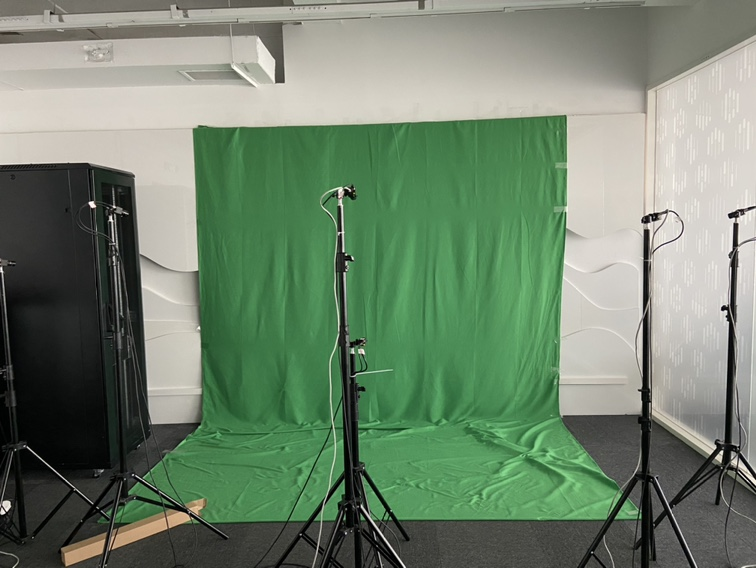
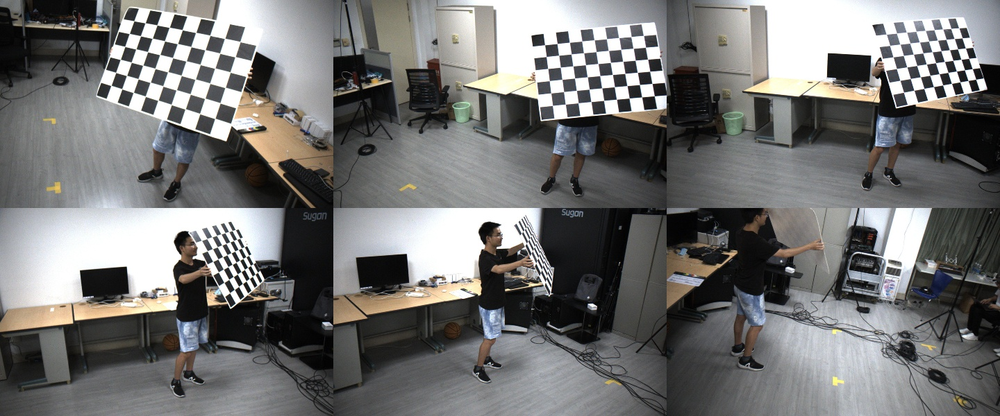

# 半身动捕工作环境

## 相机设置

在六个相机的情况，推荐使用在中间位置高低放置两个，两侧每边两个相机。

    
     相机位置设置

## 标定数据采集

如果使用棋盘格标定，需要采集3组数据，整个采集过程的注意事项有：
- 采数据时需要标定的相机需要看到棋盘格的所有角点（棋盘格的天然缺陷）
- 棋盘格尽量越大越好，材料尽量不要发生形变拍的时候
- 棋盘格不要正对着相机，需要有各个角落的倾斜
- 拍摄过程移动不要太快，避免出现运动模糊和相机不同步导致的误差

### 1. 内参标定

    
     
    内参数据：让棋盘格在相机视野范围内移动

注意事项：
- 标定需要棋盘格所有角点都可见
- 标定需要覆盖几个不同的距离，在每个距离下，包含图像视野范围的各个部分的数据
- 使用100张图像大概需要5分钟；使用200张图像大概需要2小时；使用400张图像大概需要10小时；推荐多采一些然后再采样出一些图像来使用

### 2. 外参标定

    
     
    地面信息：将棋盘格放置到地面，确保每一个相机（尽可能多的相机）都能看到。接着抓取一帧图片，如图所示。

注意事项：
- 有棋盘格的可以使用棋盘格放在地面
- 如果放到地面无法保证都可见的话，那么可以把棋盘格贴在墙面上，或者放到一个已知高度的椅子上
- 没有棋盘格的有地面的可以在地面上挑一些地砖格子都没有的手动贴胶带与标志点，控制长度
- 如果没有都能看到的位置，那么就放在想要的地面上就好，只需要尽可能多的相机能看到，后面在使用全局的匹配点进行BA优化相机

### Bundle Adjustment

    
     
    多视角优化：将棋盘格放置在地面

注意事项：
- 如果使用动态棋盘格但相机同步性较差，建议将棋盘格固定住后，静止拍摄再移动到下一位置，再静止拍摄；重复该步骤
- 如果没有棋盘格，人站在相机前将手指伸开，保持静止不动，然后换一些位置，将手指伸开，继续保持不动，这样重复

## 标定数据处理

见相机标定部分。