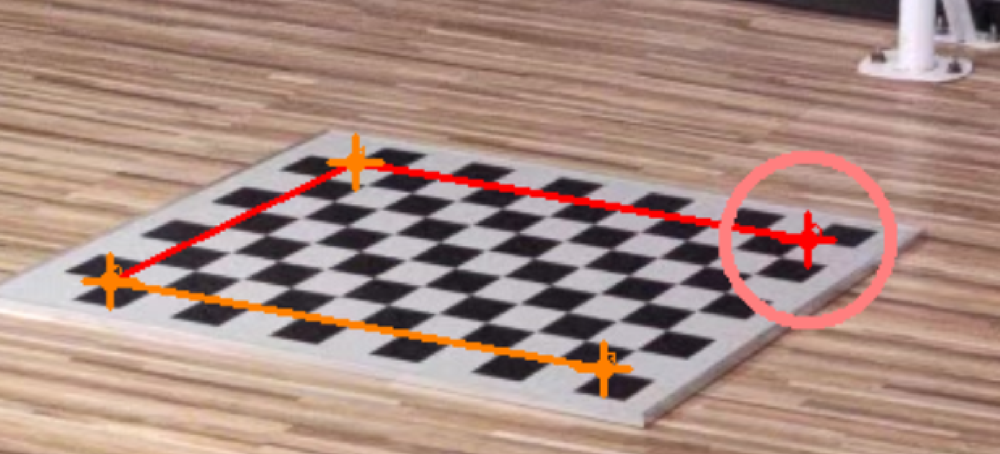

# MobileStage工作流

## 数据采集

采集一个场景时，按以下步骤核对：
- [ ] 记录当前时间、使用相机数目、ISO 
- [ ] 使用一个额外的手机，采集场景，采集时运动要慢一点，不然会有运动模糊
- [ ] 采集标定数据：每次相机被动到了都要重新标定
  - [ ] 开启相机采集空白背景
  - [ ] 采集标定板放在地上
- [ ] 采集运动数据
  - [ ] 开启手机
  - [ ] 打板
  - [ ] 保持静止一帧
  - [ ] 运动
  - [ ] 结束时保持静止
  - [ ] 打板
  - [ ] 结束采集

如果是手动触碰手机进行的采集，那么采集一次的时候要同时把标定数据和运动数据一起采集

## 数据拷贝

在目录`/nas/dataset/XiaoMiMocap`下建立当前日期的文件夹，将采集目录的videos目录拷贝或软链接到日期目录。例如

```bash
<20220511>
├── ba
│   └── videos
├── background
│   └── videos
├── ground
│   └── videos
├── data0
│   └── videos
├── data1
│   └── videos
│   ...
└── test
    └── videos
```

注意，不要直接把数据文件夹链接过来，正确的操作为

```bash
mkdir -p ba/videos && cd ba/videos
ln /nas/dataset/xiaomi_test/<data>/<seq>/videos/* ./
```

## 提取图片

手机充电口朝右的时候拍摄的视频，使用`--transpose 2`参数将视频旋转正确。

```bash
root=/path/to/root
for seq in $(ls ${root});do python3 apps/preprocess/extract_image.py ${root}/${seq} --transpose 2;done
python3 scripts/preprocess/copy_dataset.py ${root}/ground ${root}/ground1f --start 0 --end 1
python3 scripts/preprocess/copy_dataset.py ${root}/background ${root}/background1f --start 0 --end 1
```

查看采集的图片同步情况

```bash
python3 apps/annotation/annot_mv_sync.py ${root}/ba
```

主要查看内容：
1. 开始时打板是否同一帧
2. 结束时的打板是否同一帧
3. 不同序列之间不同步的相机是否固定

## 棋盘格标定：移动棋盘格标定内参+静止帧标定外参

这个方法适用于室内小场景，视角密集的情况。整理数据如下所示
```bash
<root>
├── ba # 存放棋盘格移动着标定相机的结果
│   └── images 
└── ground1f # 存放放置棋盘格的结果
    └── images 
```


**step0:** 自动检测棋盘格：

```bash
root=<path/to/root>
# 检测棋盘格
python3 apps/calibration/detect_chessboard.py ${root}/ground1f --out ${root}/ground1f/output --pattern 11,8 --grid 0.06
python3 apps/calibration/detect_chessboard.py ${root}/ba --out ${root}/ba/output --pattern 11,8 --grid 0.06 --seq --max_step 32 --min_step 8
# 检查棋盘格
python3 apps/annotation/annot_calib.py ${root}/ground1f --annot chessboard --mode chessboard --pattern 11,8
# 标定相机内参
python3 apps/calibration/calib_intri.py ${root}/ba --num 200 --share_intri
# 标定相机外参
python3 apps/calibration/calib_extri.py ${root}/ground1f --intri ${root}/ba/output/intri.yml
# 检查相机外参
python3 apps/calibration/check_calib.py ${root}/ground1f --mode match --out ${root}/ground1f --show --grid_step 0.42 --annot chessboard
```

正常情况对于`1920x1080`的图片，这里的误差需要小于`1 pixel`。

## 棋盘格标定：移动棋盘格标定内参+静止帧标定外参+移动棋盘格进行BA

这个方法通常可以获得更高的精度，前提是需要多相机同步性能较好。

标定方案选择：

- 密集视角+室内 => colmap静止背景标定+静止棋盘格对齐
-   上面不work => colmapN帧包含人的数据同时标定+静止棋盘格对齐

{: .warning }
colmap使用的版本为3.6，已知使用3.8会有数据格式不一致的问题

## colmap标定：colmap静止背景+静止棋盘格

这个方法适用于室内小场景，视角密集的情况。整理数据如下所示


```bash
├── background1f # 存放背景的单帧的结果
│   └── images 
└── ground1f # 存放放置棋盘格的结果
    └── images 
```

**step0:** 自动检测棋盘格：

```bash
root=<path/to/root>
# 检测棋盘格
python3 apps/calibration/detect_chessboard.py ${root}/ground1f --out ${root}/ground1f/output --pattern 11,8 --grid 0.06
# 检查棋盘格
python3 apps/annotation/annot_calib.py ${root}/ground1f --annot chessboard --mode chessboard --pattern 11,8
```


**step1:** colmap标定背景帧：

```bash
colmap=<path/to/colmap>
# 使用colmap标定
python3 apps/calibration/calib_by_colmap.py ${root}/background1f ${root}/colmap --no_camera --share_camera --colmap ${colmap}
# 可视化检查结果
$colmap gui --database_path ${root}/colmap/background1f_000000/database.db --image_path ${root}/colmap/background1f_000000/images --import_path ${root}/colmap/background1f_000000/sparse/0
# 读取colmap参数
python3 apps/calibration/read_colmap.py ${root}/colmap/background1f_000000/sparse/0 .bin
# 对齐colmap结果
python3 apps/calibration/align_colmap_ground.py ${root}/colmap/background1f_000000/sparse/0 ${root}/colmap/align --plane_by_chessboard ${root}/ground1f
# 可视化检查对齐后的相机外参
python3 apps/calibration/check_calib.py ${root}/ground1f --mode cube --out ${root}/colmap/align --show --grid_step 0.42
# 定量检查外参
python3 apps/calibration/check_calib.py ${root}/ground1f --mode match --out ${root}/colmap/align --show --grid_step 0.42 --annot chessboard
```

**（可选）使用人体关键点检查**

```bash
python3 apps/preprocess/extract_keypoints.py ${root}/human1f --mode mp-holistic
python3 apps/calibration/check_calib.py ${root}/human1f --mode human --out ${root}/colmap/align --write --show --annot annots --hand
```

最后一步检查中，如果相机误差超过 1pixel(1000pixel的图片)，通常被认为是误差过大。
检查colmap重建的点云质量，通常这种情况标定误差大是因为点云质量差。需要换用其他标定方法。
如果点云质量很好，标定结果误差大，可能是拍的棋盘格不同步，需要重新拍摄。


## colmap标定：手动角点+场景扫描

整理数据如下所示:

```bash
├── background1f # 存放背景的单帧的结果
│   ├── images
│   └── scan.mp4 # 存放扫描的视频
└── ground1f # 存放放置棋盘格的结果
    └── images 
```

**step0:** 创建棋盘格并手动标注

```bash
# 创建角点
python3 apps/calibration/create_marker.py ${root}/ground1f --grid 0.6 0.42 --corner --overwrite
# 标注角点
python3 apps/annotation/annot_calib.py ${root}/ground1f --annot chessboard --mode chessboard --pattern 2,2
```

<div align="center">
    
    <br>
    <sup>棋盘格不是中心对称的，标注的时候与示例对应。依次为右上角，左上角，左下角，右下角</sup>
</div>

**step1:** 同时标定scan数据和静止相机

```bash
# 使用colmap标定相机
python3 apps/calibration/calib_static_dynamic_by_colmap.py ${root}/background1f ${root}/colmap --colmap ${colmap} --num 400
# 对齐相机
python3 apps/calibration/align_colmap_ground.py ${root}/colmap/sparse/0 ${root}/colmap/align --plane_by_chessboard ${root}/ground1f --prefix static/
# 转换相机
python3 apps/calibration/colmap2nerf.py ${root}/colmap --camera ${root}/colmap/align --out ${root}/scan4nerf
# 检查相机
python3 apps/calibration/check_calib.py ${root}/ground1f --mode cube --out ${root}/scan4nerf/background1f --show --grid_step 0.6
python3 apps/calibration/check_calib.py ${root}/scan4nerf/scan --mode cube --out ${root}/scan4nerf/scan --show
python3 apps/calibration/check_calib.py ${root}/ground1f --mode match --out ${root}/scan4nerf/background1f --show --grid_step 0.6 --print3d --annot chessboard
# 确认相机参数没问题；拷贝相机参数
cp ${root}/scan4nerf/background1f/*.yml ${root}
cp ${root}/scan4nerf/background1f/*.yml ${root}/background1f
```

**step2:** 训练NeRF

```bash
# 检查背景mask
python3 apps/annotation/annot_mask.py ${root}/background1f --mask mask-background --static
# 检查背景的光照
python3 apps/annotation/annot_mv_sync.py ${root}/background1f --scale 0.3
# 训练背景NeRF
python3 apps/neuralbody/demo.py ${data} --mode danceroom-background --gpus 4,5,6,7
```

**额外标注**：背景中的物体

```bash

```


## 相机标定

主要操作:
- `shift+c`：清除所有点
- `q`: 退出，在终端选择是否保存
- `Q`: 退出不保存
- `鼠标选中框+e`：对选中区域重新检测棋盘格

这一步需要清除掉所有的错误的检测；如果错误的太多，那么后续步骤就不会使用

## 重建

```bash
root=/nas/dataset/XiaoMiMocap/20220518dance2
python3 apps/annotation/annot_clip.py ${root}/data --mv
# 手动标注，标注完成后进行拷贝
python3 apps/annotation/annot_clip.py ${root}/data --mv --copy

cp ${out}/*.yml ${data}
# multiview fitting
python3 apps/demo/mocap.py ${data} --work mobilestage --exp smpl-3d --pids 0 1 2 --subs_vis VID_11 --subs VID_04 VID_05 VID_06 VID_08 VID_09 VID_10 VID_11 VID_12 VID_14 VID_15 VID_16 VID_17 VID_19 VID_20 VID_23 VID_24 VID_25 VID_29 VID_32 VID_33 VID_34 VID_35
# extract hand from 3d keypoints
python3 apps/preprocess/extract_hand_from_3d.py ${data} --k2d ${data}/output-keypoints3d/keypoints2d --k3d ${data}/output-keypoints3d/keypoints3d --out ${data}/output-keypoints3d/keypoints2d-hand
```

## 附录

### 1. ffmpeg旋转操作

|-vf||
|1|顺时针旋转画面90度|
|2|逆时针旋转画面90度|
|3|顺时针旋转画面90度再水平翻转|
|0|逆时针旋转画面90度水平翻转|
|hflip|水平翻转视频画面|
|vflip|垂直翻转视频画面|
